```{r setup, include=FALSE}
knitr::opts_chunk$set(echo = FALSE, 
                      message = FALSE,
                      warning = FALSE,
                      fig.align = "center")
```

# Introduction

This report will introduce R package `ggplotIntro` and how I develop the package. I choose R for three main reasons: first, R is free and open-sourced; second, people can do basic analyses without advanced coding or programming knowledges; third, also the most important point, R has hundreds of packages. The `ggplot2` package is a very useful and basic package. @myint2020comparison suggests that basic R and `ggplot2` can make plots rated similarly on many characteristics, but "... ggplot2 graphics were generally perceived by students to be slightly more clearer overall with respect to presentation of a scientific relationship". `ggplot2` is so representative because it shows how R can draw plots and it always the first package when a person starts learning R. If a new learner knows how to use `ggplot2` package, the person can do basic data plotting and analysis. `ggplotIntro` Package is mainly used for new `ggplot2` package learner. Targeted group is new R learner. New R learners are defined as people who never used R before and have little knowledge about programming. I understand the difficulties for new learners because I learned accounting for my bachelor degree and I still remember how I struggled when I started learning R -- those lines of code look like puzzles to me. For anyone who wants to learn programming languages, not only R, two most important characteristics are self-motivation and self-learning. Because R is open-sourced, there are many websites can teach how to learn R, such as *stackoverflow* and *RStudio Community*. For most of problems and issues, we can find answers by googling. But I know a realistic issue for most new learners -- learning programming, especially at beginning, it's boring and difficult. For myself, at beginning, I always copy and paste sample code and make minor changes to see how output changes. It takes me a while to understand how to read documentation of packages and functions. Most of university students do not have problems about self-learning, but self-motivation could be an issue. As I said, programming is boring at beginning, so new learners need motivation. Motivation can be internal or external. My project is aiming to provide **external motivation**.

## Context of the project

Due to COVID-19, there is no companies needs interns now. First time I get in touch with my supervisor was in week 7. In first two meetings, we just have brief talk about the project and I drew a simple design sheet about the project. So, I started to work on the project since week 8. 

# Design of the shiny app and how to use it

## Gamification

In my thought, the `ggplotIntro` should be interesting. So, I studied how to make learning progress interesting. My supervisor and I both agreed that gamifying learning progress could be a good option. Educational games have been successfully used to teach a number of school subjects [@corbett2001cognitive]. As a video game lover and current R learner, I know that when a person receives positive feedback from learning/gaming, he/she is likely to be motivated and wants to learn/play more. So, the project must have a score system. A pop up window will send a congratulatory message when the user gives correct answer or send a message containing comforting words and tips on solving questions. I believe a learner will be confident when he/she got high scores in exercises.

## Why choosing shiny app

At first, my plan was to build a package like `learnr` -- use `shiny_prerendered` Rmd file to make exercises. The advantage of this plan is good example and template already existed. I can do my project by following the template. But I prefer to use shiny app because I want to make the project more interactive and more like games. Gamification is very important in my project, because I want to show new learners that make plots through R is interesting, funny and easy. If this project just asks people doing exercises, in conventional way, the project will be just like most online tutorials.

## Why designing in this way

### First tab in the shiny app

Figure \@ref(fig:p1) is an overview of my project. Left hand side is the list of contents, and right hand side is the content. The list of contents is in this order because I believe it is a common process when people draw plots. In other words, when people get access to a data set and want to draw plots for analysis, first thing first is understanding the data – such as, dimension, variable types, and missing values of the data. I introduce how to use `?` to read documentation of data sets built inside the packages. And use `summary()` to have an overview of the data set. This is the basis of data analysis and very crucial because it is unlikely to draw good plots if you know nothing about the data. I also take screenshots of `mtcars` documentation and summary as examples in first tab.

```{r p1, fig.cap="Section 1 screenshot", out.width = '100%'}
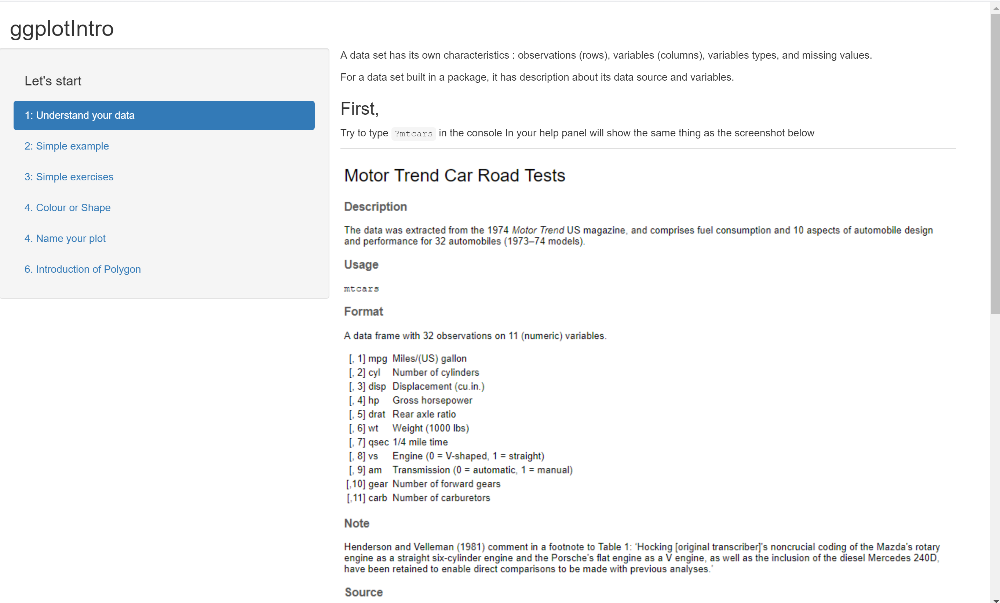
```

### Second tab in the shiny app

In second tab, I let learners play around with the code. Learners can change variables and plot types and see how the code and the plot change when they select different variables and plot types. I use `mtcars` as illustration example because it is a small data set with all numeric variables. One goal of this tab is to tell learners that it is not very hard to use `ggplot2` package to draw plots, and coding is very understandable and organised stuff. At the end of second tab, I paste a link to `ggplot2` website. On the website, more `geom_` functions are introduced. I do not want to send too much contents to new learners because this shiny app is just a start point of learning R. Another goal of second tab is to show basic `ggplot2` code to learners. Knowing the basic code is enough to draw the plot. And this leads learners to third tab of the shiny app.

```{r p2, fig.cap="Section 2 screenshot", out.width = '100%'}
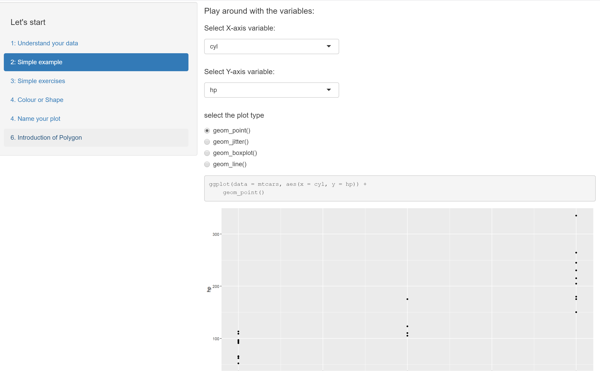
```

### Third tab in the shiny app

In third tab, I make up three very easy questions for learners. If learners read the first two tabs, they can complete all three questions in five minutes. The screenshot below shows the tab layout. The questions are all designed as fill-in-blanks style (Figure \@ref(fig:p3)). I believe this style of questions is the most acceptable questions for new learners. There are three reasons. First, this kind of questions is easy and won’t take too much time. Because this project focuses on beginner, it is not reasonable to make it very long and hard. If exercises are long, users would bother to try them; and if exercises are hard, it would make beginners lose confidence. Second, fill-in-blank questions are easier for me to make comparison to the solution. I will discuss this point later in the \@ref{Comparision} section . Third, fill-in-blanks questions can help new learners form a good coding style. When lines of code are extraordinarily long, good coding style and necessary comments are crucial. For writer him- or her- self, good coding style can make debug and review more easily. It is common that when we try to review our work which is done a few years or several months ago, we even don’t understand what we were doing at that time. So, good coding style and comments can help us remember. For other people who want to read the code, good coding style can make the code more readable. @spinellis2003reading mentioned “… programming usually is a team-based activity, and writing code that others can easily decipher has become a necessity.” So, good coding style can also ensure other team members to continue your works. 

```{r p3, fig.cap="Section 3 - Question 3 screenshot", out.width = '100%'}
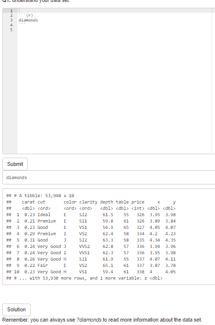
```

After complete the question, learners can click **Submit** button to see whether they are correct (Figure \@ref(fig:p3)). If they are wrong, pop-up window will be like Figure \@ref(fig:p4). It may contain a hint message. The hint message can guide learners to solve the question. When your answer is wrong, there will be no score added in the tab.

```{r p4, fig.cap="When answer is wrong, pop-up window will be like this", out.width = '100%'}
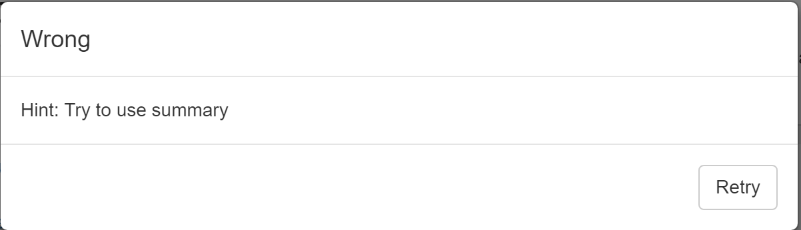
```

If they are correct, the pop-up window will be like Figure \@ref(fig:p5). And when the question is correctly answered, one score will be added.

```{r p5, fig.cap="When answer is correct, pop-up window will be like this", out.width = '100%'}
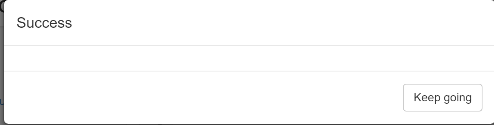
```

Users can use the **Solution** button to see the solution to the question (Figure \@ref(fig:p6)).

```{r p6, fig.cap="Solution", out.width = '100%'}
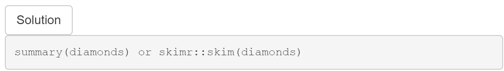
```

And users can click the below-the-folder button to check how many questions that they correctly answer in the section. Users will have two different pop-up dialog: upper window in Figure \@ref(fig:p7) will appear when users do not answer all questions correctly, lower window in Figure \@ref(fig:p7) will appear is when all questions are solved correctly. 

```{r p7, fig.cap="Score system will show two types of outcome", out.width = '100%'}
knitr::include_graphics("screenshot/tot score.png")
```


In this section, I use `diamonds` data set, because `diamonds` data set contains numeric and categorical variables. It is difficult to find a basic data set contains both types of variables. But `diamonds` has a huge disadvantage – it has `r nrow(ggplot2::diamonds)` observations. If I use all `diamonds` observations to make plot, it will take one minute to render the plot. So, I use `head()` to extract first 1000 rows in `diamonds` to reduce the time. The code chunk below is what I did for Q2. I think `head()` is reasonable because the goal of the project is not analysing data but helping new learners understand and get familiar with code.


```
ggplot(data = head(diamonds,1000), aes(x = ___, y = ___)) +
    geom_point()
```

In Q3, I talk a little about the weakness of scatterplots. And after that, I briefly introduce `geom_jitter()` and `geom_boxplot()`. In this project, I try my best to prevent overwhelming new learners. But `geom_jitter()` and `geom_boxplot()` are commonly used in practice, so, I insist introducing them.


### Fourth tab in the shiny app

In fourth section, I introduce how to use colours and shapes in data visualisation. @stone2006choosing suggests colour can enhance and clarify a presentation. 2D plots are more understandable than 3D plots. Colour and/or shape will be additional dimension(s) in the plot. In this section, I mainly introduce **colour**. Colour is more commonly used than shape in data visualisation. People’s eyes cannot detect the differences if there are more than four types of shapes in a plot. Colour can represent categorical variables, low to high numeric values, and diverging values. Colour can also represent variables with many levels. However, how to effectively use colour in data visualisation is a big topic, I can only introduce the basis of colour in data visualisation. At the end of introduction part, I use `mtcars` as example to show learners how useful colour is in data visualisation (Figure \@ref(fig:p8)).


```{r p8, fig.cap="Section 4 screenshot", out.width = '100%'}
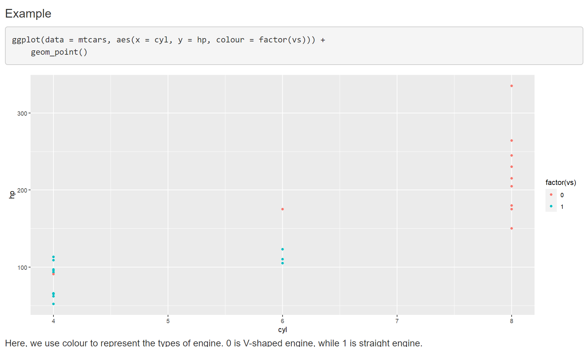
```


After introduction of colour and shapes, I give two simple exercises. I make Q4 and Q5 in order to differentiate `colour` and `fill` argument in ggplot. I use `mtcars` in Q4 while using `txhousing` in Q5. I introduce bar chart in Q5. There are too many plot types, thus, I must choose some most frequently used types. Based on my personal experience, `geom_point()`, `geom_line()` and `geom_bar()` are top-3 commonly used geom in ggplot. Q4 and Q5 tells learners that `colour` should be used in scatter plot while `fill` should be used in bar plot. If `colour` is used in Q5, the pop-up window will tell him/her `fill` should be used here (Figure \@ref(fig:p9)). 

```{r p9, fig.cap="The pop-up window for Q4", out.width = '100%'}
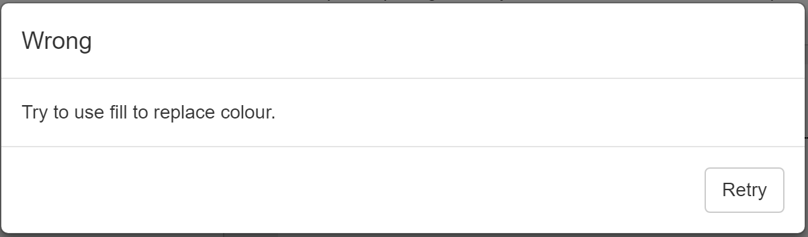
```


### Fifth tab in the shiny app

In fifth section, I introduce how to make labels in graphs. In previous section, I introduce how to make basic plots; and when a raw plot is done, plot makers should label the plot, including x- and y-axis names and units, plot title, the data source (if applicable), and legend title (if applicable). Without proper labels, plot itself will be less readable and understandable. For example, length can be measured in many different units, such as meter, inch, kilometer, etc.. And in previous section, in `mtcars`, **cyl** and **hp** are x- and y-axis, respectively. They are meaningless for readers because they have little knowledge about the data set. We must use the full name of the variables with their units to represent coordinates. So, I make one question in this section (code shown below). There is only one question because I think labelling is easy.


```
ggplot(mtcars, aes(x = cyl, y = hp)) +
  geom_point() +
  ___(___ = "Relationship between Gross horsepower and Number of Cylinders for 32 automobiles in 1974",
       ___ = "Number of Cylinders",
       ___ = "Gross horsepower")

```

### Final tab in the shiny app

The final section is harder than previous sections – I introduce Polygon. I struggle for a while because I am not sure whether I should introduce Polygon to new learners. When I learned Polygon, I thought it was difficult. But Polygon is a simple way to draw maps, and mapping is an important part in data visualisation – John Snow’s cholera map (Figure \@ref(fig:p10)) is well-known in data visualisation history. And personally, I like mapping in data visualisation.

```{r p10, fig.cap="John Snow{{’}}s cholera map", out.width = '100%'}
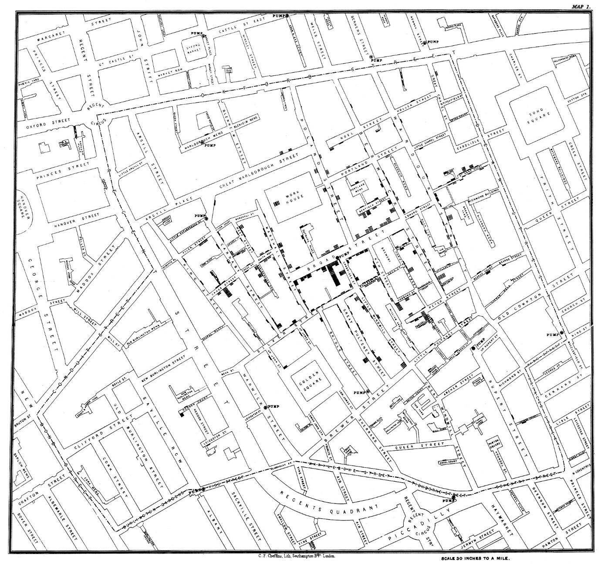
```

In this section, I introduce two steps of drawing a map (Figure \@ref(fig:p11)). First step is “get map data” and second step is “draw the map”. Here, I introduce the simplest way to get map data. And in both steps, I give comments to help learners understand the code. 

```{r p11, fig.cap="Section 6 - Introduction", out.width = '100%'}
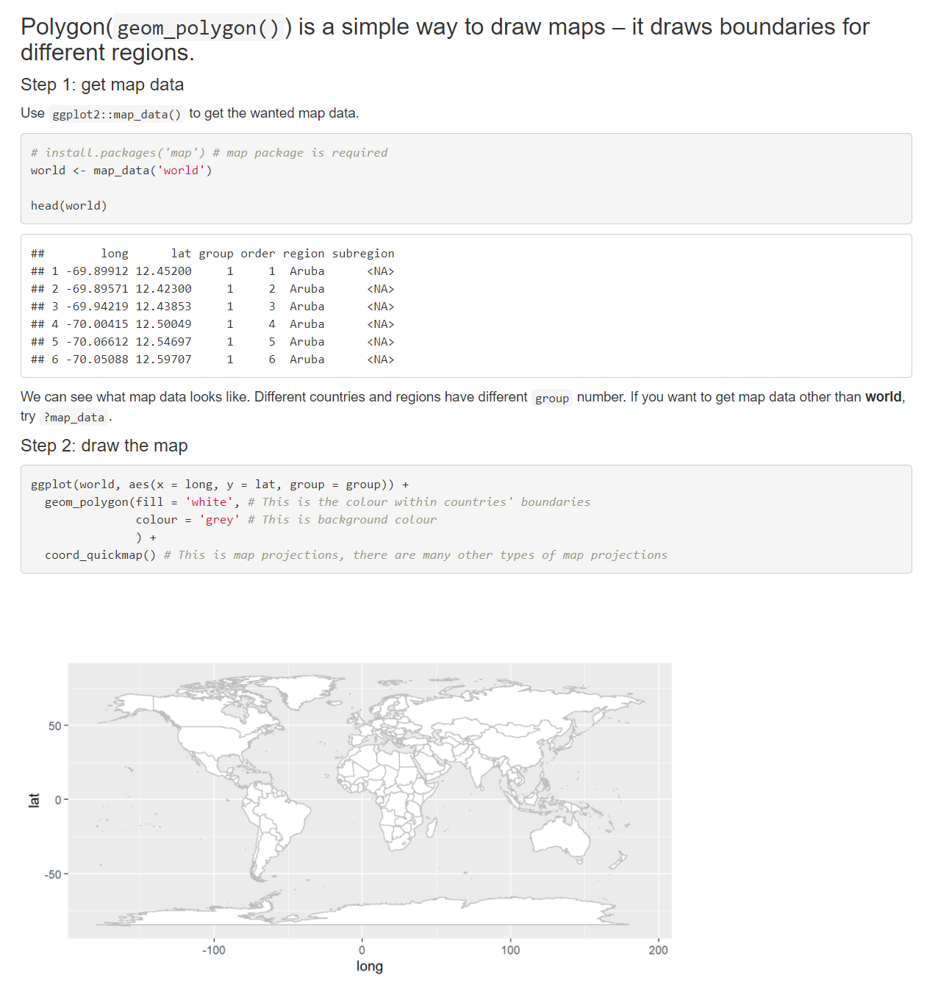
```

I also use `geom_point()` to draw the map. The aim is to show why we should use Polygon (Figure \@ref(fig:p12)).

```{r p12, fig.cap="Section 6 - comparing scatter plot to polygon", out.width = '100%'}
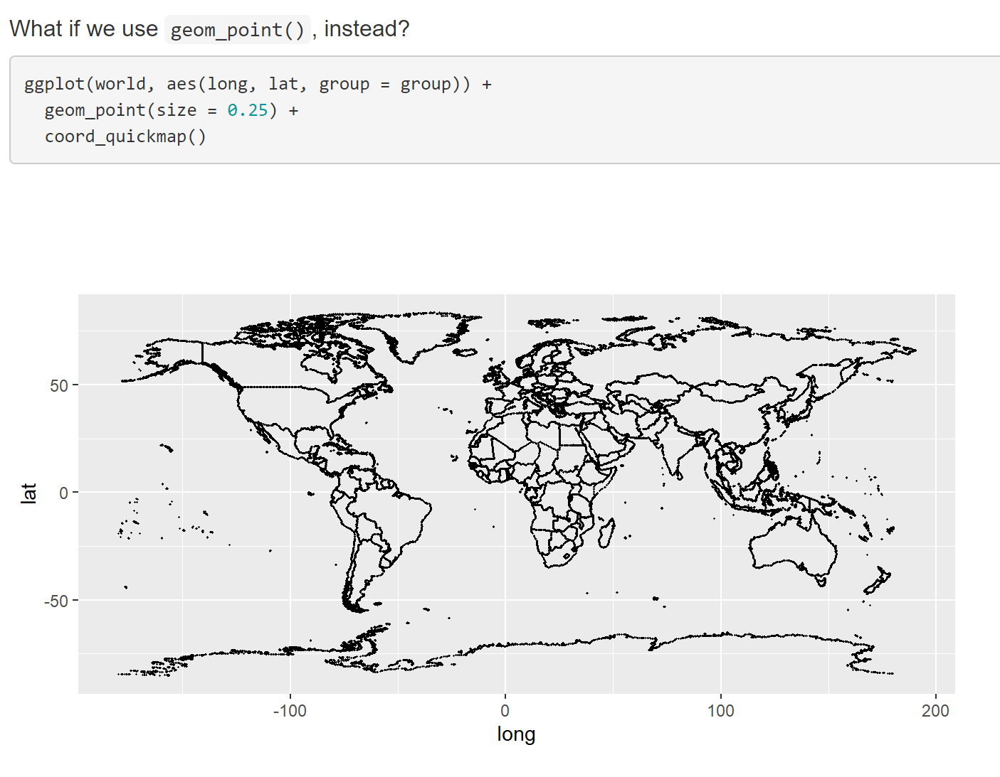
```

Next, I use `who_covid` data set and draw map for it. `who_covid`  (Figure \@ref(fig:p13)) is a data set of `ggplotIntro` package, data wrangling part will not appear in the formal shiny app within the package. `who_covid` data is downloaded from **WHO** website.


```{r p13, fig.cap="Section 6 - who covid data set", out.width = '100%'}
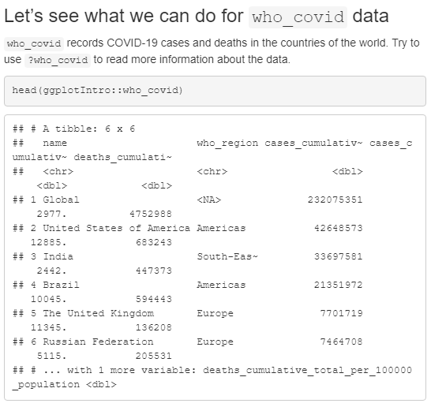
```


Figure \@ref(fig:p14) shows three steps of mapping. First step is to rename two countries to make two data sets can be merged. Second step is to merge `who_covid` and map data. Third step is to use `geom_polygon()` to draw the map.

```{r p14, fig.cap="Section 6 - who covid example", out.width = '100%'}
knitr::include_graphics("screenshot/who_covid eg2.png")
```

In this section, there are two questions – Q7 and Q8. Q7 (Figure \@ref(fig:p15)) is easy – it is almost same to the example above, except *deaths_cumulative_total* being used. Q7 is just warm up. When people first learn Polygon, they may confuse about the arguments within aes, such as, group, fill, longitude and latitude. So, I intentionally make this simple question.


```{r p15, fig.cap="Section 6 - Q7", out.width = '100%'}
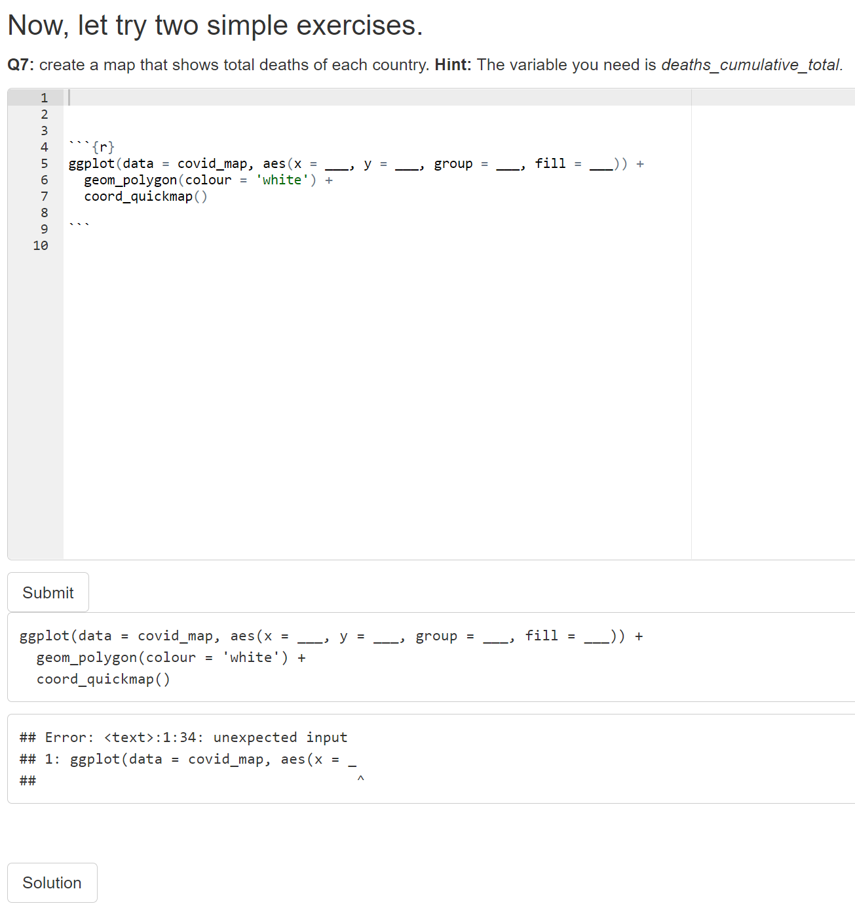
```


Q8 (Figure \@ref(fig:p16)) is little bit harder than Q7, because learners must fill in all blanks. I use a new data set here. `GDP` data is downloaded from **World Bank** website. Data wrangling is difficult for new learners, so I do all data wrangling part and merge it with map data. The merged data is called `GDP_clean`. If Q8 is answered wrongfully, hint message will pop up (Figure \@ref(fig:p17)).


```{r p16, fig.cap="Section 6 - Q8", out.width = '100%'}
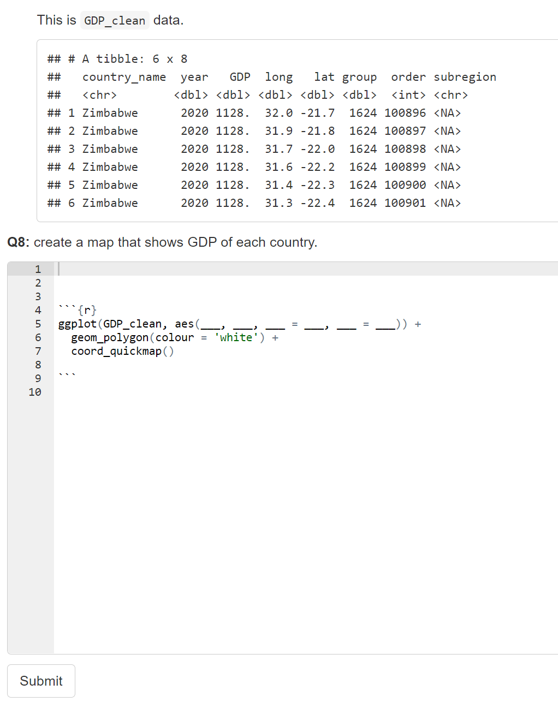
```

```{r p17, fig.cap="Section 6 - Hints for Q8", out.width = '100%'}
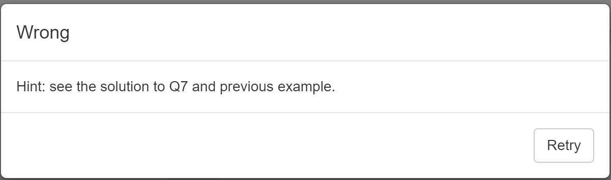
```


### About pipe operator (`%>%`)

In early version of shiny app, I frequently used pipe operator. In third meeting with Emi (my supervisor), she told me I should try to avoid using pipe operator, because it could be confusing to new learners. This remind me when I started learning R, I was also confused about pipe operator. So, I took her advice, and remove most of the pipe operators in the shiny app. However, in last two sections, in data wrangling part, the code would be too complex if not using pipe operators. But I think data wrangling part is not the main focus of the project, and I give enough comments in those parts by commenting after the lines of code. 

### Happen coincidence

I don’t want learners click the **Solution** button before at least trying the exercises. The aim of **Solution** button is to give learners some hints when they feel the exercises are too hard. In fact, in the shiny app, users cannot see the solutions before clicking **Submit** button. As the screenshot below showing, the **Solution** will keep loading and show nothing (Figure \@ref(fig:p18)). I tried and waited for over two minutes, but it was still loading. 

```{r p18, fig.cap="Loading Solution", out.width = '100%'}
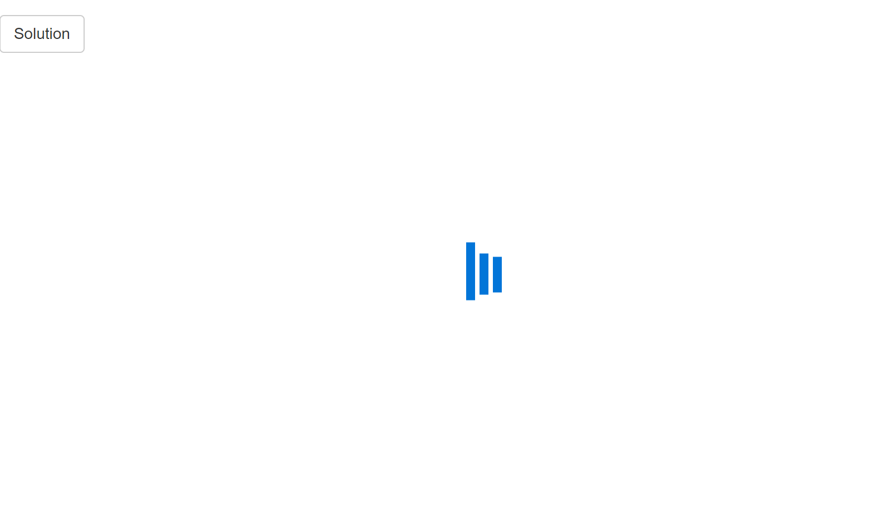
```


After clicking **Submit** button, the solution will appear (as screenshot shown below)(Figure \@ref(fig:p19)). I do not truly understand why this happens. I guess it may be sequential order between **Submit** and **Solution** buttons. That is, the content in **Solution** can be rendered only when users click **Submit** first.

```{r p19, fig.cap="Solution output", out.width = '100%'}
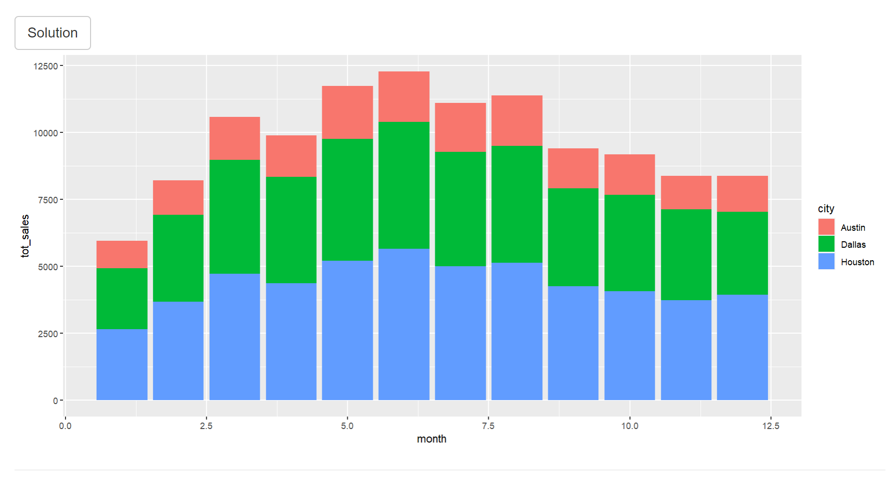
```


# References


