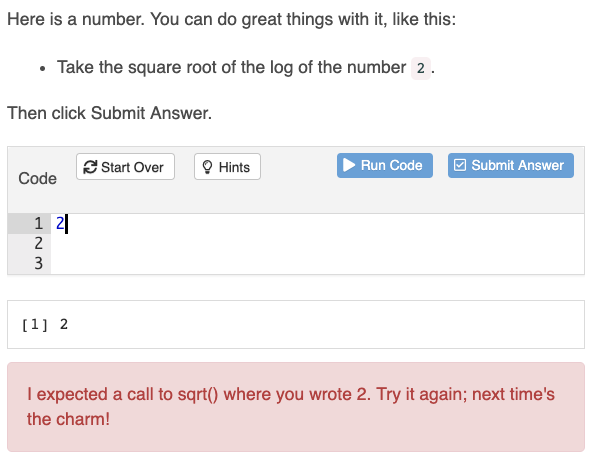

```{r setup, include=FALSE}
knitr::opts_chunk$set(echo = FALSE, 
                      message = FALSE,
                      warning = FALSE,
                      fig.align = "center")

ET <- function(comment) sprintf("\\textcolor{red}{ET: %s}", comment)
```

# Introduction

Big data and data-driven decision-making are two important concepts also of growing importance [@provost2013data]. Data-driven decision-making refers to the practice of basing decisions on the analysis of data rather than purely on intuition [@brynjolfsson2011strength]. Data-driven decision-making is wildly used for prediction. Data visualisation is fundamental within the field of statistics and data science. The `ggplot2` package [@ggplot2], built on the grammar of graphics [@wilkinson2012grammar], is a popular package that is widely used for data visualisation. @myint2020comparison suggests that base R and `ggplot2` can make plots rated similarly on many characteristics, but "... ggplot2 graphics were generally perceived by students to be slightly more clearer overall concerning to presentation of a scientific relationship".

This report describes the development of the R [@R] package `ggplotIntro`, its utility, and how to use the package. There are three main reasons that R is used as outlined below:

-   R is free and open-sourced. The open-sourced software throws light not only on how the phenomenon arises and finds a vast economic application but also on the mechanisms that underlie its massive diffusion; the tendency of Open-sourced software becomes more user-friendly will enable their diffusion in increasingly broad bands of the population [@bonaccorsi2003open].

-   people can do analyses without deeper knowledge of programming systems. The cost of code errors is lower because all the arguments to a function are evaluated before the function body is evaluated [@ihaka1996r].

-   also the most important point, R has hundreds of packages. Different packages are tools designed for different purposes. So, users of R can look for suitable packages before they create their functions.

`ggplotIntro` package is mainly used for the new `ggplot2` package learner. This package targets a new R learner, i.e. people who only have basic R programming knowledge. The package incorporates my own experience as a struggling R beginner with little programming knowledge. In the beginning, I always copied and pasted sample code and made minor changes to see how the output changes. It took me a while to understand how to read the documentation of packages and functions.

For anyone who wants to learn programming languages, not only R, the two most important characteristics are self-motivation and self-learning. Because R is open-sourced, there are many websites that can teach how to learn R, such as *stackoverflow* and *RStudio Community*. For most problems and issues, we can find answers by googling. But it is common for most new learners -- learning programming, especially at the beginning, it's boring and difficult. Most of the university students do not have problems with self-learning, but self-motivation could be an issue. New learners need motivation, and motivation can be internal or external. The project is aiming to provide **external motivation** and to help new learners cultivate **intrinsic incentives**.

# Design of the shiny app and how to use it

In this section, the report will discuss why gamifying the questions in the shiny app and why choosing shiny app. Then, the report will discuss the design of each section in the shiny app and introduce how to use the shiny app.

## Gamification {#Gamification}

The `ggplotIntro` should be interesting and help new learners cultivate interests in R. Interest was recognised as an independent factor and the desired outcome in the process of learning [@schiefele1991interest]. @lepper1988motivational proposed four general ways to increase intrinsic motivation -- behavior undertaken for its own sake, for the enjoyment it provides, the learning it permits, or the feelings of accomplishment it evokes. Two out of four could be satisfied through gamification -- promoting students' sense of control and providing challenging activities. In the shiny app, `shinyAce` [@shinyAce] editor provide a similar environment as RStudio, and the difficulty levels are increasing across sections.

So, before developing the shiny app, first thing was to study how to make learning progress interesting. Educational games have been successfully used to teach many school subjects [@corbett2001cognitive]. When a person receives positive feedback from learning/gaming, he/she is likely to be motivated and wants to learn/play more. The game versions of the scoreboard were much more enjoyable the normal version, and were more acceptable [@flatla2011calibration] So, the project must have a score system. A pop-up window will send a congratulatory message when the user gives correct answer or send a message containing comforting words and tips on solving questions. @harrington2005s studied the reflection of students when they experienced difficulties concluded that some students were likely to be highly task motivated, having capabilities to challenge a very competitive course. These students might be expected to have considerably better tolerance of discomfort but greater fears of failure; fear of failure may lead to increased anxiety and then to problems with tolerating these emotions [@harrington2005s]. So, necessary comforting messages is needed. A pop-up window is also the feedback when learners submit their answers, and the aim of pop-up windows is to make people feel more ownership and purpose when engaging with tasks [@pavlus2010game]. Furthermore, the pop-up windows can fortify the feelings of interactivity because two-way communication was one factor of increasing interactivity [\@cheng2014roles] and pop-up windows is one type of two-way communication.

In conclusion, the gamification can motivate new learners, increase the feelings of ownership and interactivity, and decrease the anxiety of learning. 


## Why choosing shiny app

At first, the plan was to build a package like `learnr` -- use `shiny_prerendered` Rmd file to make exercises. The advantage of this plan is a good example and template already existed. The developer can do the project by following the template. But the shiny app was more preferable because the project was expected to be more interactive and more like games. Gamification is very important in the project because it is more likely that new learners that make plots through R are interesting, funny, and easy (Section \@ref(Gamification)). If this project just asks people to do exercises, in a conventional way, the project will be just like most online tutorials.

In conclusion, the shiny app is more interactive and more like games. So, it makes the gamification more manageable.

## Why designing in this way

### First tab in the shiny app

Figure \@ref(fig:p1) is an overview of my project. Left-hand side is the list of contents, and right-hand side is the content. The list of contents is in this order because I believe it is a common process when people draw plots. In other words, when people get access to a data set and want to draw plots for analysis, the first thing first is understanding the data -- such as dimension, variable types, and missing values of the data. The section introduces how to use `?` to read the documentation of data sets built inside the packages. And use `summary()` to have an overview of the data set. This is the basis of data analysis and very crucial because it is unlikely to draw good plots if you know nothing about the data. The section also uses screenshots of `mtcars` documentation and summary as examples in first tab.

```{r p1, fig.cap="Section 1 screenshot", out.width = '50%'}
knitr::include_graphics("screenshot/section 1.png")
```

### Second tab in the shiny app

In the second tab, the learners can play around with the code. Learners can change variables and plot types and see how the code and the plot change when they select different variables and plot types. I use `mtcars` as an illustration example because it is a small data set with all numeric variables. One goal of this tab is to tell learners that it is not very hard to use `ggplot2` package to draw plots, and coding is very understandable and organised stuff `r ET("Language is too colloquial.")`. At the end of the second tab, the section gives a link to `ggplot2` website. On the website, more `geom_` functions are introduced. The developer does not want to spend too many contents to new learners because this shiny app is just a start point of learning R. Another goal of the second tab is to show basic `ggplot2` code to learners. Knowing the basic code is enough to draw the plot. And this leads learners to the third tab of the shiny app.

```{r p2, fig.cap="Section 2 screenshot", out.width = '50%'}
knitr::include_graphics("screenshot/section 2.png")
```

### Third tab in the shiny app

In the third tab, there are three very easy questions for learners. If learners read the first two tabs, they can complete all three questions in five minutes. The screenshot below shows the tab layout. The questions are all designed in fill-in-blanks style (Figure \@ref(fig:p3)). I believe this style of question is the most acceptable question for new learners. There are three reasons. First, this kind of question is easy and won't take too much time. Because this project focuses on a beginner, it is not reasonable to make it very long and hard. If exercises are long, users would bother to try them; and if exercises are hard, it would make beginners lose confidence. Second, fill-in-blank questions are easier for me to make the comparison to the solution. The report will discuss this point later in the \@ref(Comparision) section. Third, fill-in-blanks questions can help new learners form a good coding style. When lines of code are extraordinarily long, good coding style and necessary comments are crucial. For writer him- or herself, a good coding style can make debug and review more easily. It is common that when we try to review our work which is done a few years or several months ago, we even don't understand what we were doing at that time. So, a good coding style and comments can help us remember. For other people who want to read the code, a good coding style can make the code more readable. @spinellis2003reading mentioned, "... programming usually is a team-based activity, and writing code that others can easily decipher has become a necessity." So, a good coding style can also ensure other team members continue your works.

```{r p3, fig.cap="Section 3 - Question 3 screenshot", out.width = '50%'}
knitr::include_graphics("screenshot/section 3 Q3.png")
```

After completing the question, learners can click **Submit** button to see whether they are correct (Figure \@ref(fig:p3)). If they are wrong, a pop-up window will be like Figure \@ref(fig:p4). It may contain a hint message. The hint message can guide learners to solve the question. When your answer is wrong, there will be no score added in the tab.

```{r p4, fig.cap="When answer is wrong, pop-up window will be like this", out.width = '50%'}

```

If they are correct, the pop-up window will be like Figure \@ref(fig:p5). And when the question is correctly answered, one score will be added.

```{r p5, fig.cap="When answer is correct, pop-up window will be like this", out.width = '50%'}
knitr::include_graphics("screenshot/success.png")
```

Users can use the **Solution** button to see the solution to the question (Figure \@ref(fig:p6)).

```{r p6, fig.cap="Solution", out.width = '50%'}
knitr::include_graphics("screenshot/solution sample.png")
```

And users can click the below-the-folder button to check how many questions that they correctly answer in the section. Users will have two different pop-up dialog: upper window in Figure \@ref(fig:p7) will appear when users do not answer all questions correctly, lower window in Figure \@ref(fig:p7) will appear is when all questions are solved correctly.

```{r p7, fig.cap="Score system will show two types of outcome", out.width = '50%'}
knitr::include_graphics("screenshot/tot score.png")
```

In this section, questions are made based on `diamonds` data set, because `diamonds` data set contains numeric and categorical variables. It is difficult to find a basic data set that contains both types of variables. But `diamonds` has a huge disadvantage -- it has `r nrow(ggplot2::diamonds)` observations. If the question used all `diamonds` observations to make a plot, it would take one minute to render the plot. So, the developer uses `head()` to extract the first 1000 rows in `diamonds` to reduce the time. The code chunk below is what Q2 looks like. `head()` is reasonable because the goal of the project is not analysing data but helping new learners understand and get familiar with code.

    ggplot(data = head(diamonds,1000), aes(x = ___, y = ___)) +
        geom_point()

In Q3, discuss a little about the weakness of scatter plots. And after that, briefly introduce `geom_jitter()` and `geom_boxplot()`.

### Fourth tab in the shiny app

In the fourth section, it introduces how to use colours and shapes in data visualisation. @stone2006choosing suggests colour can enhance and clarify a presentation. 2D plots are more understandable than 3D plots. Colour and/or shape will be additional dimension(s) in the plot. In this section, I mainly introduce **colour**. Colour is more commonly used than shape in data visualisation. People's eyes cannot detect the differences if there are more than four types of shapes in a plot. Colour can represent categorical variables, low to high numeric values, and diverging values. Colour can also represent variables onmany levels. However, how to effectively use colour in data visualisation is a big topic, I can only introduce the basis of colour in data visualisation. At the end of the introduction part, `mtcars` is as an example to show learners how useful colour is in data visualisation (Figure \@ref(fig:p8)).

```{r p8, fig.cap="Section 4 screenshot", out.width = '50%'}

```

After introduction of colour and shapes, there are two simple exercises. Learners can differentiate `colour` and `fill` argument in ggplot when they finish Q4 and Q5. Q4 uses `mtcars` while Q5 uses `txhousing` in Q5. Q5 introduces bar chart. There are too many plot types, thus, only those most frequently used plot types are introduced in the shiny app. Bar chart, scatter plots, box plots, violin plots, and density plots are the types of plot which are commonly used in scientific communication [@matzen2020variable]. So, `geom_point()`, `geom_boxplot()` and `geom_bar()` are all introduced in the shiny app. Q4 and Q5 tells learners that `colour` should be used in scatter plot while `fill` should be used in bar plot. If `colour` is used in Q5, the pop-up window will tell him/her `fill` should be used here (Figure \@ref(fig:p9)).

```{r p9, fig.cap="The pop-up window for Q4", out.width = '50%'}

```

### Fifth tab in the shiny app

In the fifth section, introduce how to make labels in graphs. In the previous section, learners already understand how to make basic plots; and when a raw plot is done, plot makers should label the plot, including x- and y-axis names and units, plot title, the data source (if applicable), and legend title (if applicable). Without proper labels, the plot itself will be less readable and understandable. For example, length can be measured in many different units, such as meter, inch, kilometer, etc.. And in previous section, in `mtcars`, **cyl** and **hp** are x- and y-axis, respectively. They are meaningless for readers because they have little knowledge about the data set. We must use the full name of the variables with their units to represent coordinates. So, I make one question in this section (code shown below). There is only one question because coding for labeling is easy.

    ggplot(mtcars, aes(x = cyl, y = hp)) +
      geom_point() +
      ___(___ = "Relationship between Gross horsepower and Number of Cylinders for 32 automobiles in 1974",
           ___ = "Number of Cylinders",
           ___ = "Gross horsepower")

### Final tab in the shiny app

The final section is harder than previous sections -- it introduces Polygon. I struggle for a while because I am not sure whether I should introduce Polygon to new learners. When I learned Polygon, I thought it was difficult. But Polygon is a simple way to draw maps, and mapping is an important part of data visualisation -- John Snow's cholera map (Figure \@ref(fig:p10)) is well-known in data visualisation history. Mapping is always used in data-driven decision-making process. For example, it can be used for the political purpose -- mapping election results, and it was found as an efficient visualisation of election results [@ondrejka2016mapping].

```{r p10, fig.cap="John Snow{{’}}s cholera map"}

```

In the section, it introduces two steps of drawing a map (Figure \@ref(fig:p11)). The first step is "get map data" and the second step is "draw the map". Here, it introduces the simplest way to get map data. And in both steps, it gives comments to help learners understand the code.

```{r p11, fig.cap="Section 6 - Introduction", out.width = '50%'}
knitr::include_graphics("screenshot/section 6 intro.png")
```

The section also uses `geom_point()` to draw the map. The aim is to show why Polygon is preferable (Figure \@ref(fig:p12)).

```{r p12, fig.cap="Section 6 - comparing scatter plot to polygon", out.width = '50%'}

```

Next, it uses `who_covid` data set and draw a map for it. `who_covid` (Figure \@ref(fig:p13)) is a data set of `ggplotIntro` package, data wrangling part will not appear in the formal shiny app within the package. `who_covid` data is downloaded from **WHO** website.

```{r p13, fig.cap="Section 6 - who covid data set", out.width = '50%'}
knitr::include_graphics("screenshot/who_covid eg.png")
```

Figure \@ref(fig:p14) shows three steps of mapping. The first step is to rename two countries to make two data sets that can be merged. The second step is to merge `who_covid` and map data. The third step is to use `geom_polygon()` to draw the map.

```{r p14, fig.cap="Section 6 - who covid example", out.width = '50%'}
knitr::include_graphics("screenshot/who_covid eg2.png")
```

In this section, there are two questions -- Q7 and Q8. Q7 (Figure \@ref(fig:p15)) is easy -- it is almost the same as the example above, except *deaths_cumulative_total* being used. Q7 is just warm up. When people first learn Polygon, they may confuse about the arguments within aes, such as group, fill, longitude, and latitude. So, it intentionally makes this simple question.

```{r p15, fig.cap="Section 6 - Q7", out.width = '50%'}

```

Q8 (Figure \@ref(fig:p16)) is a little bit harder than Q7 because learners must fill in all blanks. It uses a new data set here. `GDP` data is downloaded from **World Bank** website. Data wrangling could be difficult for new learners, so the developer does all the data wrangling part and merges it with map data. The merged data is called `GDP_clean`. If Q8 is answered wrongfully, a hint message will pop up (Figure \@ref(fig:p17)).

```{r p16, fig.cap="Section 6 - Q8", out.width = '50%'}
knitr::include_graphics("screenshot/section 6 q8.png")
```

```{r p17, fig.cap="Section 6 - Hints for Q8", out.width = '50%'}
knitr::include_graphics("screenshot/q8 hint.png")
```

### About pipe operator (`%>%`)

In the early version of the shiny app, the examples and questions were frequently used pipe operator. In the third meeting with the supervisor, she suggested that the shiny app should try to avoid using pipe operator, because it could be confusing to new learners. So, most of the code containing pipe operators were rewritten. However, in the last two sections, in the data wrangling part, the code would be too complex if not using pipe operators. But the data wrangling part is not the main focus of the project, and it gives enough comments in those parts by commenting after the lines of code.

### Happen coincidence

The developer does not want learners to click the **Solution** button before at least trying the exercises. The aim of **Solution** button is to give learners some hints when they feel the exercises are too hard. In fact, in the shiny app, users cannot see the solutions before clicking **Submit** button. As the screenshot below shows, the **Solution** will keep loading and show nothing (Figure \@ref(fig:p18)). The developer tried and waited for over two minutes, but it was still loading.

```{r p18, fig.cap="Loading Solution", out.width = '50%'}

```

After clicking **Submit** button, the solution will appear (as screenshot shown below)(Figure \@ref(fig:p19)). It may be sequential order between **Submit** and **Solution** buttons. That is, the content in **Solution** can be rendered only when users click **Submit** first.

```{r p19, fig.cap="Solution output", out.width = '50%'}
knitr::include_graphics("screenshot/solution output.png")
```

# Challenges

## Text display issue

The first issue was part of the text in the shiny app does not display in the right way. Two screenshots depict the issue. After maximising the window of the shiny app, some paragraphs would be dislocated (Figure \@ref(fig:p20) and Figure \@ref(fig:p21)). Later, it was found the reason is the issue of the column width in the shiny app -- when the shiny app contained too much text in the shiny app, the text would find a way to fill the full column width.

At first, the developer tried to set specific column width for each paragraph, but it did not work. After research, all text parts were written in Md or Rmd files and used `includeMd` and `includeHTML` to solve the problem. The lesson was it is better not to include too much text in a shiny app. Too much text will make the shiny app unnecessarily long, and it is difficult to design a pretty layout in the shiny app. For instance, in the shiny app, it includes many screenshots and plots. related ui and sever must be created to show those screenshots or plots. So, the workload increases, and later if there are too much plots the loading speed of the shiny app will be slow. But if using Md file or HTML file (generated by Rmd file), it would be easy to customise the layout and draw plots. In addition, because HTML files are prerendered, reading HTML files is faster than generating plots in the shiny app. Also, `includeHTML` is just one line of code, it saves spaces and shortens the length of the shiny app.

```{r p20, fig.cap="Text display - normal", out.width = '50%'}
knitr::include_graphics("screenshot/text issue 1.png")
```

```{r p21, fig.cap="Text display - when maximising window ", out.width = '50%'}
knitr::include_graphics("screenshot/text issue 1.png")
```

## Comparison to the solutions {#Comparision}

The first plan was to follow the structure of `dwexercise` package. But there is big differences between *shiny-prerendered Rmd file* and *shiny app*. If using *shiny-prerendered Rmd file*, with `learnr` package, it is very easy to create code chunks letting users fill the answers. If using shiny app, the structure will be totally different, because *shiny-prerendered Rmd file* supports users to run code while *ui* and *server* are both required in shiny app. Ui input can be problematic because some types of input would cause errors in *server* part. For instance, Figure \@ref(fig:p2) was the first-version plan -- the questions provide multiple choices to learners. The advantage of this plan is easy to construct; the disadvantage are the sense of control being reduced and limited choices could limit learners' thinking.

The second version was to let learners enter code freely. This version was similar to [`dwexercise`](https://ebsmonash.shinyapps.io/ecssc2021/#section-what-is-r), but in shiny it was more complicated. If a user wants to enter and run code in basic shiny, there are one option -- `textInput`. But if using `textInput` it would generate two more problems. One way is to let users enter the full code of ggplot. The main difficulty here is how to tell the right or wrong of the code. Different coding styles and spaces between variables and arguments can make the comparison difficult.

`gradethis`, `vdiffr` and `testthat` are three packages can make the comparison. `gradethis` is a package which is always used with `learnr`. It can compare learners' answers with solutions and gives messages to learners when answers are wrong. However, `gradethis` is compatible with shiny.

```{r p22, fig.cap="gradethis package", out.width = '50%'}

```

The next plan is to use `vdiffr` which is a `testthat` extension for monitoring the appearance of R plots. To use this package, solution plots should be saved, so later they can be used to make the comparison. Using `vdiffr` would make the package too large because of too many SVG files saved in `_snap()` folder. `testthat` is not a good option, either. It is too complicated in shiny.

Learners must enter the code in one line if using `textInput`. This is a problem if the code is too long, such as in the Polygon section. The sense of control is also reduced because learners can only know whether their answers are right or wrong. They don't know which part of the answer goes wrong. So, the project will not satisfy the goals of gamification and cultivating good coding style. Finally, `shinyAce` solved all these problems. `shinyAce` can create a code chunk which is same as the code chunk in **R studio**. It enables users to enter and run code in the shiny app. Thus, even the answer is wrong, learners can see the output, which is important because there are two types of wrong answers. One is syntax error, the other is using wrong arguments or wrong variables. This is a big disadvantage when using `textInput`. Only telling students that they are wrong could result in making students remember the right answers. Merely remembering the "right answer" is harmful in learning programming. The plan is to make all exercises in the shiny app are fill-in-blanks style, and `shinyAce` is the simple way to fulfill the plan. Another reason for making fill-in-blanks exercises is relatively technical. As mentioned before, different coding styles and spaces between variables and arguments can make the comparison difficult. The fill-in-blanks questions are easy to make comparison.

## Pop-up windows

In the early version of the shiny app, the plan was to create a UI similar to Figure \@ref(fig:p22). After a few days, as Section \@ref(Comparison) mentioned, `gradethis`, `vdiffr` and `testthat` were not compatible with shiny. The next version of the plan was simpler than the first one -- each question has a solution plot, and lets users use their eyes to compare their answers to the solution. This plan was abandoned soon because the shiny app would be interactive no longer. It also reduces the level of gamification. In this version of the plan, the scoreboard would no longer exist because the comparison to the solution was done by users instead of the shiny app.

Later, `shinyAce` and fill-in-blanks questions were determined as the final version of the questions in the shiny app. The pop-up windows are built through `showModal` and `modalDialog`. The first version of pop-up windows was simple. It only contained a one-word message -- **Success** or **Wrong**. The second version differentiated the close buttons -- **Keep going** was for **Success** while **Retry** was for **Wrong**. In the final version, **Hint** buttons were removed, and hint messages were merged in pop-up windows. It has **three** advantages. First, it would not show hints to learners before trying the exercises. Second, it makes the layout of the shiny app look tidier and smarter. In the early version, for each question, there were three buttons: **Submit**, **Hint** and **Solution**. Learners could read the hints at any time. Now, **Hint** buttons no longer exist, and the hint messages will only be available to learners when learners submit wrong answers (Figure \@ref(fig:p9)). Third, it reduces the length and complexity of the shiny script. Previously, in the server part, there were 3-4 lines of code for hint message output; now, they were replaced by one line of code. In conclusion, pop-up windows increase the feeling of gamification and interaction, and also tidy the shiny script.

The chunk below shows the latest version of the shiny script. The score and hint message are merged in one function.

        observeEvent(input$eval8, {
            if (input$Q8 == q8sol) {
                ModalTitle = "Success"
                ModalText = NULL
                ModalFooter = tagList(
                    modalButton("Keep going")
                )
                score_q8 <<- 1 # Score

            } else {
                score_q8 <<- 0 # Score
                ModalTitle = "Wrong"
                ModalText = "Hint: see the solution to Q7 and previous example." # Hint message
                ModalFooter = tagList(
                    modalButton("Retry")
                )
            }
            showModal(modalDialog(
                title = ModalTitle,
                ModalText,
                footer = ModalFooter
            ))
        })

## Modulising the shiny app through `source()`

Previously, all sections were in `app.R` file. So, the `app.R` file was extremely long. It had three weaknesses. First, it took too much time when the developer wanted to make any changes in the previous section because there were hundreds of lines of code in `app.R` file. Second, it was unfriendly for debugging process. The debugging would be very difficult if the developer could not locate the wrongful code section. Third, the shiny app could be hardly maintained and further developed in the future.

Modulising the shiny app has two advantages. First, it can shorten the length of the main shiny script. Second, it is convenient for the developer and others to add more questions and section in the future. However, during modulisation process, every time restarting R and running the shiny app, the error messages, such as "q2sol not found", appeared. At the same time, the code chunks for exercises became blank boxes. The reason was all questions were saved as rds files and sourced by the shiny app, but exercise entries and solutions were excluded. The problem was solved by sourcing the whole question script.

## Making up questions and finding data sets

In the second, third, and fourth sections, `mtcars` and `diamonds` data sets are used. There were two reasons for using these two data sets. First, new learners may be familiar with these two data sets because they are two commonly used data sets when people started learning R. Second, it saved time for the developer. Due to the tight schedule, the developer did not have too much time for looking for new data. However, if the shiny app still used old data sets, it would be interesting no longer. But finding new data did not equal finding a random data set. New data set must satisfy three requirements -- interesting, useful and timely. At the same time, new data set must be proper for questions. Proper for questions means:

-   the observations of the new data set should be proper -- not too large nor too small (if too large, it would take too much loading time; if too small, questions would be too easy) ;
-   the variables of the new data set should be proper -- not too many nor too few (if too many, learners might spend too much time on questions; if too few, it was difficult to make questions based on the data set);
-   new data set should be proper for different plot types.

In conclusion, the developer needed to make the trade-off between time and quality. Consequently, `ggplotIntro` package has two data sets -- `Who_covid` which was downloaded from WHO, and `GDP` which was from World Bank (Both data sets are used in the shiny app).

It is also tricky to make up questions based on the data. The questions must balance difficulty level and meaningfulness. An example of a meaningless question is drawing a plot of time against date. After consideration, the developer decided to keep the questions based on `mtcars` and `diamonds` because the developer wanted to make a question bank (Section \@ref(Improvement)).

## Make the shiny app as a package

In [R packages book](https://r-pkgs.org/r.html), it pointed that "the first principle of making a package is that all R code goes in the `R/` directory" [@wickham2015r]. The main part of the shiny app is R script, and to transfer a shiny app to R package is put the R script of the shiny app into `R/`. Most online tutorial agrees because they are teaching how to transfer one simple shiny app script to packages. The simple shiny app refers to the shiny app that contains R script only.

For `ggplotIntro`, the situation is different. Figure \@ref(fig:p23) shows how the shiny app looks like -- in the app folder, there are two folders (i.e. `questions` and `sections`), and many Rmd and html files. `questions` and `sections` folders contain modulised questions and sections R file.

The first trial was to put everything in `R/`. An error message was displayed, and the shiny app could not function at all. The reason was Rmd and html files were introduction paragraphs used in each section, which were not R code, thus, they could not be in `R/`. So, the tricky part is how to locate these files and folders.

```{r p23, fig.cap="The app folder", out.width = '50%'}
knitr::include_graphics("screenshot/app folder.png")
```

@wickham2015r mentioned, "When a package is installed, everything in inst/ is copied into the top-level package directory. ... You are free to put anything you like in `inst/` with one caution: because `inst/` is copied into the top-level directory." The second trial was to put everything in `inst/`. An error message was displayed because `launch_app()` could not launch the shiny app. Later, in the weekly meeting with the developer's supervisor, the issue was found. The reason was the structure of the shiny app in `inst/` -- All contents must be in the same `app/` within `inst/`. In the third trial, the repo was `ggplotIntro/inst/app`. The third trial succeeded.

The shiny app used two new data sets, and the data sets were built into the package. So, some code chunks were changed (Figure (\@ref(fig:p24)) gives one example). One advantage of making such changes was to tidy the shiny app layout. Another advantage was to cut off some data wrangling code chunks. The main focus of the project is to teach ggplot, so, the learners should not be distracted from ggplot by data wrangling.

```{r p24, fig.cap="The app folder", out.width = '50%'}
knitr::include_graphics("screenshot/transfer to package 1.png")
```

## Some improvement {#Improvement}

At the time of writing the report, there were some improvements that could and should be applied to the shiny app. First, build a question bank. The question bank has three benefits. First, give learners random questions. @callender2009limited suggested students benefit a little from rereading and restudying coherent and complex learning material. If the shiny app gives the same question to all learners every time, it is not beneficial for learners to restudying and reusing the exercises within the shiny app. In addition, the shiny app would lose characteristics of gamification and fun soon. Promotion of long-term retention is substantial, and the learning material should allow students to apply their knowledge in a variety of contexts [@ebersbach2020comparing]. Second, question banks can offer students questions of different difficulty levels. One way of increasing intrinsic motivation is to give people challenging questions [@lepper1988motivational]. @alexander2013investigation also said that when playing games players enjoyed more, if the difficulty satisfied their gaming experience. Thus, it is necessary and better to offer questions of proper difficulty levels to learners. Third, the questions in the shiny app will be fresh and new to learners, so that the novelty will not wear off very soon.

The second improvement is to make functions to tidy the shiny script. There are many duplicated codes in the shiny script. For instance, for questions, the solution part, pop-up window part, and user entry part are using similar structure of code, respectively. If similar code can be created as a function, the shiny script can be tidier. Another advantage is that it is more convenient for question creation in the future.

# Acknowledgement

This project would not have been possible without Emi Tanaka, the project supervisor, and Mitchell O'Hara-Wild. They helped a lot when developing the shiny app. The developer would also like to thank Jessica Leung.

# References
